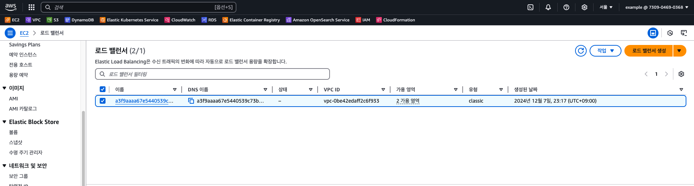

# Infra

## Infra 구성도


## 구축 상태 보고

API Repository에서 아래 명령어를 통해 배포한 Pod, Service, 프로비저닝된 AWS loadbalancer 구축 상태입니다.

**API Server**
```bash
helm upgrade api charts/api-server --install
```

**DB**
```bash
helm upgrade db charts/db --install 
```

**Pod**


**SVC**


**AWS Loadbalancer**
